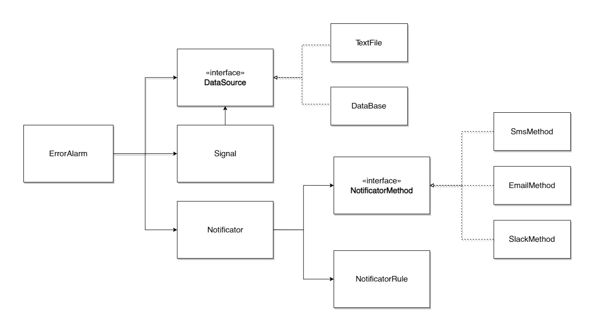

# Error Alarm

## Introduction

We need a new alarm service that notify different error events. We are not concerned about these errors when their frequency is low. However, when lots of errors occur in a short period of time, there may be a problem with the application and we want to be notified immediately.
The solution will involve the current logging service but adding a new alerts layer. That allow us to abstract the alerts from the logging, so will be easy to add new kinds of alerts in the future.

## Goals [or Motivating Use Cases, or Scenarios]

The final solution must guarantee:

1. Send notifications by email.
2. Send notifications when certanin amount of errors in a period of time is reached. E.g.: when more than ten errors occur in one minute, we want to receive an email notification.
3. Limit the notifications to one for period of time. E.g.: Must not send more than one email per minute.

## ErorAlarm Service

To achieve our goals I designed `Error Alarm` service. It's an isolated service that delegate in more granular tasks the general purpose. At least, we need to:

1.  Get logged data
2.  Validate some signals from it
3.  Send notifications if it's needed.
4.  Orchestate all this flow

We can check that structure is represented in this diagram:



### DataSource

`DataSource` interface should have several methods that allow to each component get its needed information. In this way we can abstract where this information come and get a common type for the next process instances.

The sourcing process start getting the new line from the log source and aggregating it to some cache. The internal cache has only the most recent rows, getting rid the oldest ones.

In our case, we can connect `ErrorAlarm` to our log file adding a new `TextFile` data source. We only should set the path and the log line schema to connect the source to our `ErrorAlarm` service.

```ts
interface DataSource {
  get(): Promise<LogRow[]>;
  getSince(startDate: Date): Promise<LogRow[]>;
  // We can include here any other access method that we want.
}
```

```ts
type LogRowCustomField = {
  key: string;
  value: string | number | boolean;
};

class LogRow {
  logline: string;
  createdAt: Date;
  customFields: LogRowCustomField[];

  getCustomFieldByKey(key: string): LogRowCustomField;
}
```

### Signal

`Signal` has the ability to make different operations (logical comparations, text search, count rows, etc) over any dataset provided by the `DataSource` interface.The final result is boolean that indicates if the validation check the signal or not. Probably we can break this class in several parts to get the needed info, transform and use it from the `DataSource`.

```ts
interface Operator<T, R> {
  // I got this Operator interface from an old personal project.
  values: T;
  resolve(): R;
}

class CountElements implements Operator<LogRow[], number> {
  constructor(values: T[]) {
    this.values = values;
  }

  resolve(): number {
    return this.values.length;
  }
}

class Signal {
  constructor(private dataSource: DataSource, private operators: Operator) {}

  async test(): Promise<boolean> {
    // Here we should make use of dataSource to get the needed log rows
    // and bring them to the operators functions that will validate the the signal.
  }
}
```

To check if more than ten errors occur in one minute we can make use of the `DataSource.getSince` method and check the total `LogRow` elements are more than ten with the CountElements operator.

## Notificator
